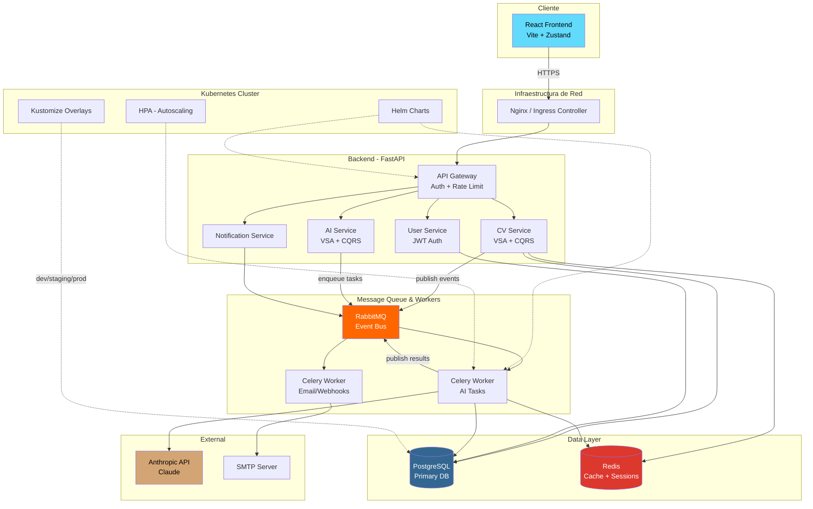

# CV Simulator — Arquitectura General

## 1. Overview

Aplicación de portfolio/CV interactivo que permite a los usuarios crear, gestionar y compartir su CV profesional con capacidades de IA para sugerencias y generación de contenido.

**Servicios principales:**
- **API Gateway** — Punto de entrada, rate limiting, autenticación
- **CV Service** — CRUD de CVs, secciones, templates (Vertical Slice + CQRS)
- **AI Service** — Integración con LLMs para generación y análisis
- **Notification Service** — Emails, webhooks (consume mensajes de RabbitMQ)
- **Frontend** — SPA React para la interfaz de usuario

**Comunicación entre servicios:**
- **Síncrona:** REST APIs entre Frontend → API Gateway → Services
- **Asíncrona:** RabbitMQ para eventos (cv.created, cv.analyzed, ai.suggestion.ready)
- **Caché:** Redis para sesiones, rate limiting y resultados de IA frecuentes

---

## 2. Estructura de Carpetas

```
cv-simulator/
│
├── README.md
├── docker-compose.yml
├── docker-compose.dev.yml
├── docker-compose.prod.yml
├── Makefile
├── .github/
│   └── workflows/
│       ├── ci.yml
│       ├── cd-staging.yml
│       └── cd-production.yml
│
├── backend/
│   ├── Dockerfile
│   ├── pyproject.toml
│   ├── alembic.ini
│   ├── alembic/
│   │   └── versions/
│   │
│   ├── src/
│   │   ├── main.py                     # FastAPI entrypoint
│   │   ├── config.py                   # Settings con Pydantic
│   │   ├── dependencies.py             # Dependency injection
│   │   │
│   │   ├── shared/                     # Código compartido
│   │   │   ├── database.py             # Engine, session factory
│   │   │   ├── rabbitmq.py             # Publisher/consumer base
│   │   │   ├── redis_client.py         # Redis connection
│   │   │   ├── auth/                   # JWT middleware
│   │   │   ├── exceptions/             # Custom exceptions
│   │   │   └── models/                 # Base models compartidos
│   │   │
│   │   ├── cv/                         # === CV SERVICE (Vertical Slices) ===
│   │   │   ├── create_cv/
│   │   │   │   ├── endpoint.py         # POST /api/cvs
│   │   │   │   ├── command.py          # CreateCvCommand
│   │   │   │   ├── handler.py          # CreateCvHandler
│   │   │   │   └── validator.py
│   │   │   ├── get_cv/
│   │   │   │   ├── endpoint.py         # GET /api/cvs/{id}
│   │   │   │   ├── query.py            # GetCvQuery
│   │   │   │   └── handler.py          # GetCvHandler
│   │   │   ├── update_section/
│   │   │   │   ├── endpoint.py
│   │   │   │   ├── command.py
│   │   │   │   └── handler.py
│   │   │   ├── list_cvs/
│   │   │   ├── delete_cv/
│   │   │   ├── export_pdf/
│   │   │   ├── domain/
│   │   │   │   ├── entities.py         # CV, Section, Skill
│   │   │   │   └── events.py           # CvCreated, SectionUpdated
│   │   │   └── infrastructure/
│   │   │       └── repository.py       # SQLAlchemy repository
│   │   │
│   │   ├── ai/                         # === AI SERVICE (Vertical Slices) ===
│   │   │   ├── analyze_cv/
│   │   │   │   ├── endpoint.py         # POST /api/ai/analyze
│   │   │   │   ├── command.py
│   │   │   │   └── handler.py          # Envía tarea a Celery
│   │   │   ├── suggest_improvements/
│   │   │   │   ├── endpoint.py
│   │   │   │   ├── query.py
│   │   │   │   └── handler.py
│   │   │   ├── generate_summary/
│   │   │   │   ├── endpoint.py
│   │   │   │   ├── command.py
│   │   │   │   └── handler.py
│   │   │   └── infrastructure/
│   │   │       ├── llm_client.py       # Anthropic/OpenAI client
│   │   │       └── prompts.py          # Prompt templates
│   │   │
│   │   ├── users/                      # === USER SERVICE ===
│   │   │   ├── register/
│   │   │   ├── login/
│   │   │   ├── get_profile/
│   │   │   └── domain/
│   │   │
│   │   └── notifications/              # === NOTIFICATION SERVICE ===
│   │       ├── workers/
│   │       │   ├── email_worker.py     # Celery task: envío emails
│   │       │   └── webhook_worker.py
│   │       └── templates/
│   │
│   └── tests/
│       ├── conftest.py
│       ├── cv/
│       ├── ai/
│       └── users/
│
├── frontend/
│   ├── Dockerfile
│   ├── package.json
│   ├── vite.config.ts
│   ├── public/
│   └── src/
│       ├── main.tsx
│       ├── App.tsx
│       ├── api/                        # API client (axios/fetch)
│       ├── components/
│       │   ├── ui/                     # Componentes base (buttons, inputs)
│       │   ├── cv/                     # CvEditor, CvPreview, SectionForm
│       │   └── ai/                     # AiSuggestions, AnalysisPanel
│       ├── pages/
│       │   ├── Dashboard.tsx
│       │   ├── CvEditor.tsx
│       │   ├── CvPreview.tsx
│       │   └── Login.tsx
│       ├── hooks/
│       ├── store/                      # Zustand o Redux Toolkit
│       └── types/
│
└── infra/
    ├── docker/
    │   ├── nginx/
    │   │   └── nginx.conf
    │   └── postgres/
    │       └── init.sql
    │
    ├── k8s/
    │   ├── base/                       # Kustomize base
    │   │   ├── kustomization.yaml
    │   │   ├── namespace.yaml
    │   │   ├── backend/
    │   │   │   ├── deployment.yaml
    │   │   │   ├── service.yaml
    │   │   │   └── hpa.yaml
    │   │   ├── frontend/
    │   │   │   ├── deployment.yaml
    │   │   │   └── service.yaml
    │   │   ├── postgres/
    │   │   │   ├── statefulset.yaml
    │   │   │   ├── service.yaml
    │   │   │   └── pvc.yaml
    │   │   ├── redis/
    │   │   ├── rabbitmq/
    │   │   ├── celery-worker/
    │   │   │   └── deployment.yaml
    │   │   └── ingress.yaml
    │   │
    │   └── overlays/                   # Kustomize overlays
    │       ├── dev/
    │       │   ├── kustomization.yaml
    │       │   └── patches/
    │       ├── staging/
    │       │   ├── kustomization.yaml
    │       │   └── patches/
    │       └── prod/
    │           ├── kustomization.yaml
    │           ├── patches/
    │           └── secrets/
    │
    └── helm/
        └── cv-simulator/
            ├── Chart.yaml
            ├── values.yaml
            ├── values-dev.yaml
            ├── values-staging.yaml
            ├── values-prod.yaml
            └── templates/
                ├── _helpers.tpl
                ├── backend-deployment.yaml
                ├── frontend-deployment.yaml
                ├── celery-deployment.yaml
                ├── ingress.yaml
                ├── configmap.yaml
                └── secrets.yaml
```

---

## 3. Propuesta de Integración de IA

### Funcionalidades

| Feature | Descripción | Implementación |
|---|---|---|
| **Análisis de CV** | Evalúa fortalezas/debilidades del CV (contenido, estructura, keywords) | Celery task → LLM analiza el CV completo → resultado cacheado en Redis |
| **Generación de resumen profesional** | Genera el "About Me" basado en experiencia y skills del usuario | Endpoint síncrono → LLM genera texto → usuario edita |
| **Sugerencias de mejora** | Propone mejoras por sección (experiencia, educación, skills) | Background job → publica resultado vía RabbitMQ → frontend recibe vía polling/SSE |
| **Adaptación por puesto** | Ajusta el CV para un job posting específico (el usuario pega la oferta) | Celery task → LLM compara CV vs job description → sugiere cambios |
| **Generación de bullet points** | Transforma descripciones vagas en bullet points con métricas | Endpoint síncrono, respuesta rápida |

### Flujo técnico de IA

```
Usuario solicita análisis
       │
       ▼
  POST /api/ai/analyze
       │
       ▼
  Handler publica tarea en RabbitMQ
       │
       ▼
  Celery Worker consume la tarea
       │
       ├── Consulta CV desde PostgreSQL
       ├── Verifica caché en Redis
       ├── Llama al LLM (Anthropic API)
       ├── Guarda resultado en Redis (TTL: 1h)
       └── Publica evento "ai.analysis.ready" en RabbitMQ
              │
              ▼
       Frontend recibe resultado (polling GET /api/ai/analyze/{id}/status)
```

---

## 4. Diagrama de Arquitectura



---

## 5. Cronograma de Desarrollo

**Disponibilidad:** 3-4 horas diarias (~25 horas/semana)

| Fase | Semanas | Horas Est. | Entregable | Milestone |
|---|---|---|---|---|
| **Fase 0 — Setup** | Semana 1 | 20h | Monorepo inicializado, Docker Compose con todos los servicios levantados, CI básico | ✅ `docker-compose up` funciona con todos los servicios |
| **Fase 1 — Auth + Users** | Semana 2 | 25h | Registro, login, JWT, protección de rutas | ✅ Usuario puede registrarse y autenticarse |
| **Fase 2 — CV Core (Backend)** | Semanas 3-4 | 50h | Slices: create, get, list, update, delete CV + secciones. Tests con pytest | ✅ CRUD completo de CVs vía API |
| **Fase 3 — Message Queue** | Semana 5 | 20h | RabbitMQ + Celery integrados, worker de notificaciones, eventos básicos | ✅ Eventos publicados y consumidos correctamente |
| **Fase 4 — AI Service** | Semanas 6-7 | 40h | Slices de IA: analyze, suggest, generate summary. Redis cache. Background processing | ✅ IA analiza un CV y devuelve sugerencias |
| **Fase 5 — Frontend** | Semanas 8-10 | 60h | React app: dashboard, editor de CV, preview, panel de sugerencias IA | ✅ App funcional end-to-end en local |
| **Fase 6 — Docker + Optimization** | Semana 11 | 20h | Dockerfiles multi-stage optimizados, docker-compose.prod.yml, health checks | ✅ Build en < 2 min, imágenes < 200MB |
| **Fase 7 — Kubernetes** | Semanas 12-13 | 40h | Manifiestos K8s base, Kustomize overlays (dev/staging/prod), Helm chart | ✅ App desplegada en K8s local (minikube/kind) |
| **Fase 8 — CI/CD** | Semana 14 | 25h | GitHub Actions: test → build → push image → deploy a staging | ✅ Push a main despliega automáticamente |
| **Fase 9 — Polish** | Semana 15-16 | 30h | Documentación, README, monitoring básico, export PDF, fixes | ✅ Proyecto listo para portfolio |

---

**Total estimado: ~330 horas / 16 semanas (4 meses)**

### Milestones clave para tu portfolio

- **Semana 4** → Puedes mostrar el backend con VSA + CQRS funcionando
- **Semana 7** → Puedes demostrar integración de IA + async processing
- **Semana 10** → App funcional completa en local
- **Semana 14** → Pipeline CI/CD completo, demostrable en entrevistas
- **Semana 16** → Proyecto terminado y documentado
